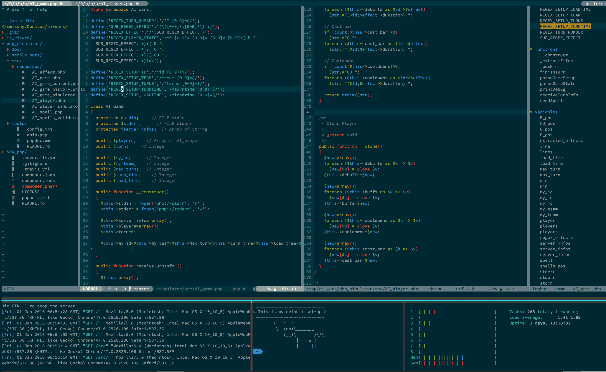

```
__     _____ __  __           ____  _             _           
\ \   / /_ _|  \/  |         |  _ \| |_   _  __ _(_)_ __  ___ 
 \ \ / / | || |\/| |  _____  | |_) | | | | |/ _` | | '_ \/ __|
  \ V /  | || |  | | |_____| |  __/| | |_| | (_| | | | | \__ \
   \_/  |___|_|  |_|         |_|   |_|\__,_|\__, |_|_| |_|___/
                                            |___/             
```

[](gallery/)

## Text editor configuration

The following sections contain a descriptive list of most of the plugings I use in my `.vimrc` configuration to make vim even more awesome.

### Language

* Expand [html and css abreviations](http://docs.emmet.io/cheat-sheet/)
* Linter and code style check support on status bar
* Display real time markdown rendering

### Completion

* Auto-close characters
* Support of [code snippets](https://github.com/Shougo/neosnippet-snippets/tree/master/neosnippets)
* [Code](https://f.cloud.github.com/assets/214488/623496/94ed19a2-cf68-11e2-8d33-3aad8a39d7c1.gif), [filename](https://f.cloud.github.com/assets/214488/623151/284ad86e-cf5b-11e2-828e-257d31bf0572.png), [omni](https://f.cloud.github.com/assets/41495/622456/fb2cc0bc-cf42-11e2-94e8-403cdcf5427e.png), [shell](https://f.cloud.github.com/assets/41495/622458/01dbc660-cf43-11e2-85f1-326e7432b0a1.png) smart auto-completion
* Search auto-completion

### Code display

* Various programming language syntax coloration
* Javascript main libraries syntax coloration
* [Indent guides](http://i.imgur.com/ONgoj.png) ([multiple display](http://i.imgur.com/2ZA7oaZ.png) supported)
* Color preview in source code ([for example in css](http://ap.github.io/vim-css-color/screenshot.png))
* More than 500 colorscheme supported (default [solarized](http://ethanschoonover.com/solarized))

### Integrations

* Full git commands integration ([Fugitive screencast](http://vimcasts.org/categories/git/))
* Git diff characters [in sign colomn](https://raw.github.com/airblade/vim-gitgutter/master/screenshot.png)
* [Repository and file history](http://www.gregsexton.org/images/gitk-vim.jpg) interactive display
* Complete [shell integration](https://f.cloud.github.com/assets/980000/982716/eb45a994-0817-11e3-806e-ce6e731b86ef.png)
* Code structure sidebar (Angular also supported)
* Full Github gist integrations
* Get documentation of word under cursor
* Get type of word under cursor
* Jump to definition of word under cursor
* tmux integration to navigate between panes

### Interface

* Can display relative line numbers
* Fuzzy file finding (project, recents, buffers)
* Navigation tree (with git integration)
* [Side bar to jump to previous actions (tree)](http://farm5.static.flickr.com/4113/5093114605_ebc46d6494.jpg)
* Custom and configurable [statusbar interface](https://github.com/bling/vim-airline/wiki/screenshots/demo.gif)
* Support of [devicon](http://devicon.fr/) for filetypes 
* [Custom landing page with last files edited](https://raw.githubusercontent.com/mhinz/vim-startify/102aa438b2d2a88e2b4e331d8ff5320eed52f0c4/startify.png)

### Commands

* Jump to anywhere by [key shortcut](https://f.cloud.github.com/assets/3797062/2039359/a8e938d6-899f-11e3-8789-60025ea83656.gif)
* Shortcuts for characters alignment
* Easily comment lines
* Support save of session (visible from landing page)
* Multiple cursor feature for quick re-factor

### Others

* Add more motion on top on vim native
* Add more mapping on top of vim native
* Add more text object selectors on top of vim native
* Check the `.vimrc` itself to see the rest :)
